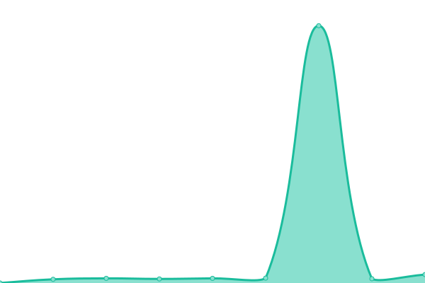

# [📈 Live Status](https://lessonpal.github.io/upptime-lessonpal): <!--live status--> **🟩 All systems operational**

This repository contains the open-source uptime monitor and status page for [Lessonpal](https://lessonpal.com), powered by [Upptime](https://github.com/upptime/upptime).

With [Upptime](https://upptime.js.org), you can get your own unlimited and free uptime monitor and status page, powered entirely by a GitHub repository. We use [Issues](https://github.com/lessonpal/upptime-lessonpal/issues) as incident reports, [Actions](https://github.com/lessonpal/upptime-lessonpal/actions) as uptime monitors, and [Pages](https://lessonpal.github.io/upptime-lessonpal) for the status page.

<!--start: status pages-->
<!-- This summary is generated by Upptime (https://github.com/upptime/upptime) -->
<!-- Do not edit this manually, your changes will be overwritten -->
<!-- prettier-ignore -->
| URL | Status | History | Response Time | Uptime |
| --- | ------ | ------- | ------------- | ------ |
|  [Lessonpal](https://lessonpal.com) | 🟩 Up | [lessonpal.yml](https://github.com/lessonpal/upptime-lessonpal/commits/HEAD/history/lessonpal.yml) | 

 233ms
     
 | 

<a href="https://lessonpal.github.io/upptime-lessonpal/history/lessonpal">100.00%</a>
    

|  [stagin-env](https://staging.lessonpal.com) | 🟩 Up | [stagin-env.yml](https://github.com/lessonpal/upptime-lessonpal/commits/HEAD/history/stagin-env.yml) | 

 3908ms
     
 | 

<a href="https://lessonpal.github.io/upptime-lessonpal/history/stagin-env">99.76%</a>
    

<!--end: status pages-->

[**Visit our status website →**](https://lessonpal.github.io/upptime-lessonpal)

## 📄 License

- Powered by: [Upptime](https://github.com/upptime/upptime)
- Code: [MIT](./LICENSE) © [Lessonpal](https://lessonpal.com)
- Data in the `./history` directory: [Open Database License](https://opendatacommons.org/licenses/odbl/1-0/)
